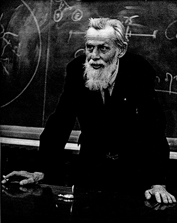
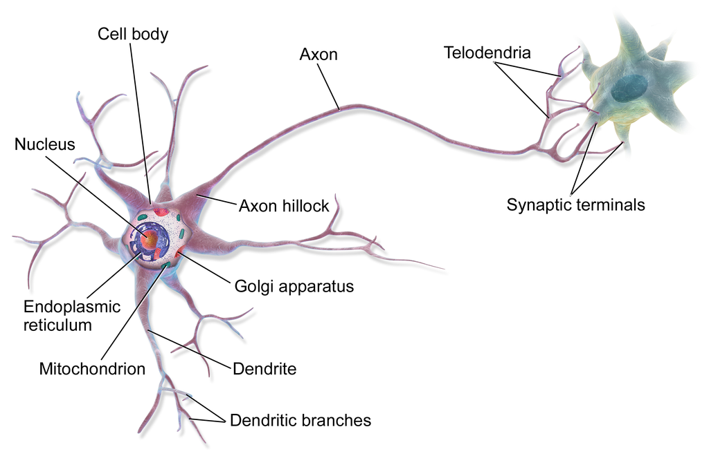
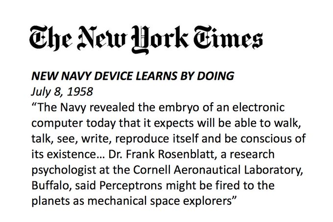
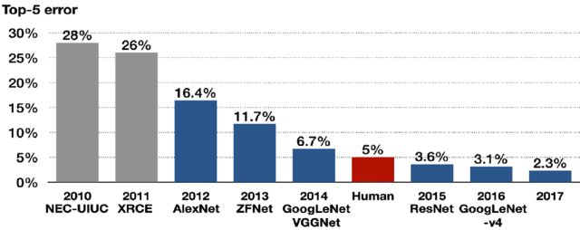

# Introducción

¡Bienvenidos al Mini Workshop de Redes Neuronales para GANEs! Estamos entusiasmados por brindarles esta oportunidad de aprender a aplicar técnicas de aprendizaje profundo utilizando Python y TensorFlow en problemas comunes del campo, como la clasificación de imágenes.

## Una breve historia de las redes neuronales y el aprendizaje profundo

### Primeras formulaciónes

En 1941 Warren McCulloch, un neurofisiólogo y Walter Pitts un filósofo lógico autodidacta de 18 años se conocen a través de un amigo en común. Pitts es todo un personaje que se las arregló para impresionar a filósofos de la talla de Bertrand Russell y Rudolf Carnap a pesar de no tener siquiera un título secundario. Pitts logró impresionar también a McCulloch y rápidamente desarrollaron una intensa relación intelectual.

::: {layout-ncol="2"}

:::

En aquella época, ya se reconocía ampliamente que el cerebro humano estaba compuesto por una intrincada red de neuronas interconectadas. Cada neurona poseía conexiones de entrada, conocidas como dendritas, y conexiones de salida, denominadas axones. Cuando los impulsos eléctricos provenientes de las dendritas superaban un umbral determinado, la neurona generaba un impulso eléctrico a través del axón. Fue en este contexto que Warren McCulloch y Walter Pitts comenzaron a establecer una relación entre estas acciones neuronales y los principios lógicos.

Según sus investigaciones, la presencia o ausencia de un impulso eléctrico podía ser interpretada como verdadero o falso. Si el umbral de activación era lo suficientemente bajo como para que la neurona se disparara ante la activación de cualquiera de sus entradas, esto equivaldría a una operación lógica "o". Por otro lado, si el umbral era tan alto que la neurona solo se activaba cuando todas sus entradas se activaban simultáneamente, esto equivaldría a una operación lógica "y". McCulloch y Pitts llegaron a la conclusión de que no existía ningún aspecto de la lógica formal que no pudiera ser expresado por medio de estas redes neuronales. En 1943, publicaron el influyente artículo fundacional titulado ["A logical calculus of the ideas immanent in nervous activity"](https://link.springer.com/article/10.1007/BF02478259).

Si bien estudios posteriores demostraron que el funcionamiento de las neuronas biológicas no es tan simple como lo postularon McCulloch y Pitts, su trabajo tuvo un impacto significativo en el desarrollo de las redes neuronales artificiales. Sus investigaciones sentaron las bases para posteriores avances en este campo, impulsando la exploración y el estudio de las redes neuronales como herramientas para el procesamiento de información y la inteligencia artificial.

### Primeras aplicaciones prácticas 

En 1958, Frank Rosenblatt, investigador de la Oficina de Investigación Naval de los Estados Unidos, presentó una demostración de una innovadora máquina a la que llamó "perceptrón".

Durante la demostración, Rosenblatt utilizó una cámara para capturar imágenes de tarjetas que mostraban un cuadrado de color. Este cuadrado podía ubicarse en el lado derecho o izquierdo de la tarjeta. La cámara digitalizaba las tarjetas y las convertía en imágenes de 20 x 20 píxeles, representadas por valores binarios: ceros y unos, correspondientes a la presencia o ausencia de luz. Estos cuatrocientos valores eran luego procesados por una red neuronal, basada en el concepto desarrollado por McCulloch y Pitts. Cada píxel era multiplicado por un peso y la suma total era calculada. Si el resultado era negativo, el perceptrón emitía un valor de -1, indicando que el cuadrado se encontraba a la izquierda. En cambio, si el resultado era positivo, se emitía un +1, lo que indicaba que el cuadrado se encontraba a la derecha.

Inicialmente, los pesos eran asignados al azar, lo que hacía que el perceptrón produjera resultados inconsistentes. Sin embargo, cada vez que se equivocaba, Rosenblatt ajustaba los pesos, incrementando aquellos que eran demasiado bajos y disminuyendo los que eran demasiado altos. Después de cincuenta intentos, el perceptrón lograba distinguir consistentemente entre los cuadrados ubicados a la derecha o a la izquierda. Con esto, Rosenblatt demostró un mecanismo para "entrenar" una red neuronal artificial y capacitarla para realizar tareas complejas.

Esta demostración de Rosenblatt marcó un hito en el desarrollo de las redes neuronales, ya que demostró su capacidad para aprender y adaptarse a través de la modificación de los pesos. Su trabajo sentó las bases para futuros avances en el campo del aprendizaje automático y allanó el camino hacia el desarrollo de redes neuronales más sofisticadas y poderosas.

### El largo invieron de las redes neuronales.

En la actualidad, consideramos que la inteligencia artificial y las redes neuronales son desarrollos muy recientes. Sin embargo, es importante destacar que en la segunda mitad del siglo XX ya se habían sentado las bases fundamentales y existía una gran expectativa sobre sus posibles aplicaciones. Entonces, ¿qué ocurrió para que esta área se detuviera prácticamente por décadas?

En 1969, Marvin Minsky y Seymour Papert publicaron el libro "Perceptrón", en el cual presentaron una demostración matemática que revelaba las limitaciones de las redes neuronales de una sola capa para resolver problemas matemáticos simples pero críticos, como los de tipo XOR. También señalaron que esta limitación podría superarse mediante el uso de redes de múltiples capas, en las cuales las primeras capas aprenderían a representar los datos y las siguientes operarían sobre esas representaciones. Sin embargo, en aquel momento no se encontró una forma práctica de entrenar estas diferentes capas. Según Minsky:

> Se habían publicado varios miles de artículos sobre perceptrón hasta 1969, nuestro libro puso fin a esos

Este descubrimiento condujo a un período conocido como "el invierno de las redes neuronales", que duraría décadas. Sin embargo, con el tiempo comenzaron a surgir pequeños avances. Hacia 1986, Rumelhart, Hinton y Williams popularizaron un método de entrenamiento para redes multicapa conocido como "propagación hacia atrás" (backpropagation en inglés). Con este método, se volvió posible entrenar redes neuronales con múltiples capas, siempre y cuando se tuviera suficiente poder de cómputo. 

A finales de la década de 1980 y principios de la década de 1990, Yann LeCun[^introducción-1], quien había trabajado como investigador postdoctoral con Hinton, desarrolló la primera aplicación comercial de una red neuronal entrenada mediente backpropagation: [la lectura de códigos postales en el correo de Estados Unidos](https://ieeexplore.ieee.org/document/6795724).

[^introducción-1]: Actualmente Chief AI Scientist en Meta

Estos avances fueron solo el comienzo de un resurgimiento en el campo de las redes neuronales, y sentaron las bases para los desarrollos futuros que estamos presenciando en la actualidad. Los principales obstáculos hacia los años 2000 eran la capacidad de cómputo y el tamaño y la calidad de los datasets. Según Hinton:

> Nuestros datasets etiquetados eran miles de veces demasiado chicos. \[Y\] nuestras computadoras millones de veces demasiado lentas.

### El renacimiento de las redes neuronales

El panorama comenzó a cambiar con la llegada de Internet. Ahora teníamos acceso a repositorios virtualmente infinitos de imágenes. Además, la calidad y cantidad de etiquetas también comenzaron a aumentar. En 2005, Amazon lanzó su servicio de ["Turco mecánico"](https://www.mturk.com/), una plataforma que permite reclutar una fuerza laboral a gran escala para realizar tareas sencillas. Entre 2007 y 2009, Fei-Fei Li, de Princeton, aprovechó Amazon Mechanical Turk para crear [ImageNet](https://www.image-net.org/), un conjunto de datos que consta de tres millones de imágenes clasificadas por humanos en 5000 categorías (como aviones, barcos, motocicletas, entre otras). Desde 2010, equipos de todo el mundo compiten anualmente para desarrollar los métodos más eficaces en la tarea de distinguir las diferentes categorías presentes en ImageNet.

En la Universidad de Toronto, Alex Krizhevsky dio un paso importante al programar GPUs para ejecutar el código necesario para entrenar una red neuronal profunda. Sorprendentemente, este hardware, originalmente diseñado para juegos, resultó perfecto para acelerar el proceso de entrenamiento. Con mejoras inteligentes en la arquitectura de la red y en el método de entrenamiento, la red conocida como AlexNet logró ganar la competencia de ImageNet en 2012. No solo superó a sus competidores más cercanos al cometer la mitad de los errores, sino que también mejoró en casi un 10% el rendimiento del modelo ganador del año anterior.

Los avances en la siguiente década fueron asombrosos. En 2015, una nueva arquitectura de red neuronal llamada ResNet superó la capacidad de clasificación humana en el desafío de ImageNet. Las redes neuronales se expandieron hacia tareas cada vez más complejas, como la localización de objetos en imágenes, el reconocimiento facial, los mapas de segmentación y se adentraron en otros dominios como el lenguaje, la traducción y la clasificación de texto. En los últimos años, hemos presenciado el surgimiento de redes neuronales con capacidad creativa, capaces de generar imágenes y texto. Proyectos impresionantes como [DALL-E](https://openai.com/product/dall-e-2) y [ChatGPT](https://openai.com/blog/chatgpt), desarrollados en el último año, son ejemplos destacados de este avance.

## Herramientas del oficio

En este workshop, utilizaremos exclusivamente Python, un lenguaje de programación que se destaca por su facilidad de aprendizaje. Python cuenta con una sintaxis intuitiva y posee una gran potencia. Además, las bibliotecas más populares para el aprendizaje profundo tienen una excelente integración con Python, lo que lo convierte en el lenguaje dominante en esta área. Es ampliamente utilizado en campos como la ciencia de datos, el machine learning y tiene una fuerte presencia en el ámbito académico y científico en general.

### TensorFlow vs. PyTorch

Existen diversas bibliotecas que facilitan la programación, el entrenamiento y la utilización de redes neuronales. Estas bibliotecas son fundamentales, ya que permiten separar el diseño y la implementación de las redes neuronales del código optimizado especialmente para llevar a cabo las operaciones algebraicas que forman la base de los métodos de aprendizaje profundo. Además, estas bibliotecas pueden aprovechar de manera eficiente hardware especializado como las GPUs y TPUs.

::: callout-tip
[Graphics Processing Unit (GPU)](https://es.wikipedia.org/wiki/Unidad_de_procesamiento_gr%C3%A1fico). También conocidas como placas gráficas son tipos especiales de procesadores que pueden manejar miles de tareas simultáneas, están especialmente diseñadas para gráficos 3D y son usadas comúnmente para videojuegos y diseño gráfico. Adicionalmente, son capaces de acelerar la ejecución de redes neuronales cientos de veces comparados a una CPU normal.
:::

::: callout-tip
[Tensor Processing Unit (TPU)](https://es.wikipedia.org/wiki/Unidad_de_procesamiento_tensorial). Son circuitos integrados de aplicación específica diseñados específicamente para acelerar redes neuronales.
:::

En la actualidad, dos bibliotecas de aprendizaje profundo dominan prácticamente el mercado: TensorFlow y PyTorch.

TensorFlow, lanzada en 2015 por desarrolladores de Google, es la biblioteca más antigua de las dos y se destaca por su capacidad en términos de producción y despliegue. Aunque la primera versión de TensorFlow se consideraba difícil de usar debido a su paradigma de programación basado en grafos estáticos, la versión actual, TensorFlow 2, ha realizado cambios significativos. Ahora permite la ejecución instantánea del código (conocido como "modo eager") y ha incorporado Keras, una biblioteca de alto nivel que simplifica enormemente la especificación de arquitecturas de redes neuronales y el desarrollo de códigos de entrenamiento e inferencia.

Por otro lado, PyTorch fue lanzado en 2017 por Facebook y rápidamente se ganó popularidad, especialmente en el ámbito académico, gracias a su facilidad de uso. Aunque TensorFlow 2 fue lanzado posteriormente, PyTorch sigue siendo ampliamente utilizado por investigadores, lo que implica que los nuevos desarrollos tienden a aparecer primero en esta plataforma.

En la actualidad, no existen diferencias significativas en cuanto a la funcionalidad de ambas bibliotecas, especialmente para arquitecturas bien establecidas. Además, los principios aprendidos en una plataforma son fácilmente transferibles a la otra, lo que brinda flexibilidad a los usuarios para elegir la que mejor se adapte a sus necesidades.

::: callout-tip
Si desean obtener más información sobre las diferencias entre TensorFlow y PyTorch, pueden consultar el [siguiente artículo](https://www.assemblyai.com/blog/pytorch-vs-tensorflow-in-2023/).
:::

### Jupyter notebooks y Google Colab

Los códigos de aprendizaje profundo suelen ejecutarse de manera más rápida en computadoras equipadas con GPU de NVIDIA. Sin embargo, no es necesario comprar una GPU, ya que existen alternativas gratuitas o asequibles. Además, configurar una computadora con las herramientas necesarias puede ser complicado y requiere tiempo y dedicación considerable.

Una opción recomendada es utilizar [Google Colab](https://colab.research.google.com/), una plataforma gratuita (con opción de pago) que permite ejecutar códigos de Python en la nube. Viene preconfigurada con TensorFlow y otras bibliotecas relevantes, y ofrece acceso **limitado** a GPU y TPU.

El formato de código que se utiliza en Google Colab es similar y compatible con los [Jupyter Notebooks](https://jupyter.org/). Estos notebooks son documentos interactivos que combinan texto, código ejecutable y la capacidad de mostrar los resultados del código en el mismo documento. Esta combinación los hace especialmente útiles para la educación y muy populares entre científicos de datos y otras áreas académicas, ya que permiten la interactividad, una rápida retroalimentación y la posibilidad de prototipar código rápidamente.

Todo el código que presentaremos será compatible con Google Colab, lo cual les permitirá probar y modificar rápidamente el código a su gusto. Sin embargo, si prefieren ejecutar el código de forma local, pueden seguir esta [guía de instalación de TensorFLow](https://www.tensorflow.org/install).

::: callout-tip
Hay otras plataformas gratuitas similares a Google Colab, las más conocidas son: [Kaggle](https://www.kaggle.com/) y [SageMaker Studio Lab](https://studiolab.sagemaker.aws/)
:::

## Qué es el aprendizaje automático

El aprendizaje automático o "machine learning" son algoritmos y técnicas usadas para resolver problemas que los humanos realizan intuitivamente y prácticamente de forma automática, pero que son muy difíciles de realizar por computadoras siguiendo simplemente una receta rígida. 

Hacia finales de los 1950, un investigador de IBM, Arthur Samuel comenzó a desarrollar una forma distinta de programar computadoras. Su idea básica era que, en vez de decirle a la computadora paso a paso lo que tenía que hacer, mejor era mostrarle ejemplos del problema a resolver y dejar que ella encuentre la forma de resolverlo sola. Con ello desarrolló un programa para jugar a las damas que ajustaba su funcionamiento en función de las partidas ganadas y perdidas. Al poco tiempo Samuel estaba perdiendo contra su propia creación. Escribió un reporte titulado "Some Studies in Machine Learning Using the Game of Checkers", popularizando el término "machine learning" para describir a la metodología.

El aprendizaje profundo es una sub rama dentro del campo del aprendizaje automático, enfocada al uso de redes neuronales profundas. Sin embargo, el concepto básico sigue siendo el mismo: aprender a partir de los datos para cumplir algún objetivo. 

Podemos individualizar los aspectos más importantes de la metodología.

1. Tener un modelo que determina un resultado a partir de datos y "parámetros" internos.
2. Que el resultado del modelo pueda ser evaluado (automáticamente) a través de alguna métrica de rendimiento.
3. Que exista un mecanismo automático para mejorar el rendimiento a través de la modificación de los parámetros internos.

A lo largo del workshop vamos a ir profundizando las técnicas que permiten realizar cada uno de estos aspectos para que nuestros modelos "aprendan".

## Tipos de aprendizaje

Existen tres tipos fundamentales de aprendizaje: aprendizaje supervisado, aprendizaje no supervisado y aprendizaje semi-supervisado. Estos tipos difieren en los datos utilizados y en el objetivo del aprendizaje. En este workshop nos centraremos en técnicas supervisadas en el contexto del aprendizaje profundo. Sin embargo, proporcionaremos una breve descripción de cada tipo para comprender claramente sus diferencias.

### Aprendizaje supervisado.

En el aprendizaje supervisado, contamos con datos de entrenamiento y una forma determinista de evaluar el rendimiento de un modelo en esos datos. Un ejemplo clásico es un clasificador de imágenes que se entrena con imágenes etiquetadas. Estas etiquetas describen el contenido de cada imagen de manera precisa.

Nuestro clasificador supervisado puede hacer predicciones sobre el contenido de una imagen de entrenamiento y determinar si la predicción fue correcta al compararla con la etiqueta correspondiente. Con base en esto, el modelo puede actualizar sus parámetros de manera iterativa hasta alcanzar el nivel de precisión deseado en la clasificación.

Los métodos supervisados son ampliamente conocidos y desarrollados en el campo del aprendizaje automático debido a que su implementación es bastante directa y sus resultados son relativamente fáciles de interpretar. Sin embargo, surge un gran desafío en la creación de conjuntos de datos de entrenamiento debido a la necesidad de proporcionar etiquetas, lo cual puede ser una tarea intensiva y costosa. En algunos proyectos, resulta casi imposible obtener etiquetas de alta calidad, especialmente si los datos son de nicho, se cuenta con un equipo de desarrollo pequeño o se tienen recursos limitados.

### Aprendizaje no supervisado.

En el aprendizaje no supervisado no existen etiquetas o noción de verdad absoluta (*ground truth*). El objetivo principal es descubrir patrones y estructuras en los datos que puedan brindar información útil.

En general, los métodos de aprendizaje no supervisado son menos frecuentes que los supervisados, ya que su implementación tiende a ser más compleja y su utilidad y evaluación no son tan evidentes. Suelen requerir un sólido conocimiento del dominio en el que se aplican para poder determinar si los patrones identificados son realmente relevantes o meramente espurios. Estos métodos se utilizan principalmente de forma exploratoria para extraer información oculta o no evidente en los datos.

Algunos ejemplos de algoritmos no supervisados son el Análisis de Componentes Principales (PCA), las técnicas de agrupamiento (clustering) en sus diversas variantes y, específicamente en el ámbito de las redes neuronales, los autoencoders, los Mapas Auto-organizados (SOMs) y los métodos contrastivos.

Además, estos métodos no supervisados pueden formar parte de un algoritmo más complejo, en el cual se aplica un método supervisado sobre la representación obtenida a partir de un método no supervisado. La idea subyacente es que la clasificación basada en dicha representación funcione mejor que si se aplicara directamente sobre los datos crudos originales.

### Aprendizaje semi supervisado.

Son técnicas que se utilizan en casos donde tenemos algunas etiquetas pero no para todos los ejemplos. Es una especie de híbrido entre aprendizaje supervisado y no supervisado.

La idea es que se utilice todos los datos para encontrar la estructura, pero que los datos etiquetados nos den contexto y actúen como prueba de cordura. Por ejemplo podemos hacer que el algoritmo utilice los ejemplos etiquetados para pre clasificar el resto de los datos y todo eso junto utilizar como set de entrenamiento. Esta metodología se puede aplicar iterativamente para que el modelo vaya mejorando de a poco. 

La ventaja de estos métodos es que alivian la necesidad de tener datos de entrenamiento costosos de obtener. 

## Datasets

Por lo que estuvimos viendo un aspecto fundamental del aprendizaje automático son las características de los datos disponibles. En la jerga, el conjunto de datos que utiliza un algoritmo de aprendizaje se lo denomina dataset. 

Existen datasets de todo tipo, por ejemplo ya nombramos ImageNet. En la próxima sección vamos a profundizar sobre los datasets y ver como empezar a utilizarlos en TensorFlow.